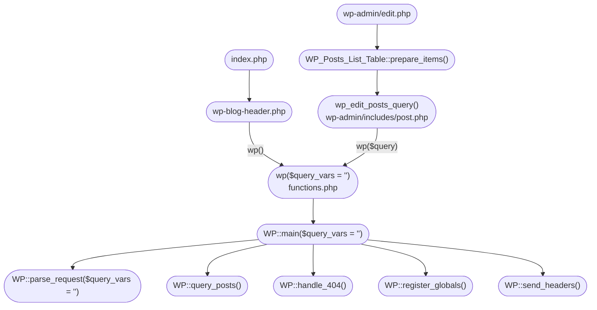
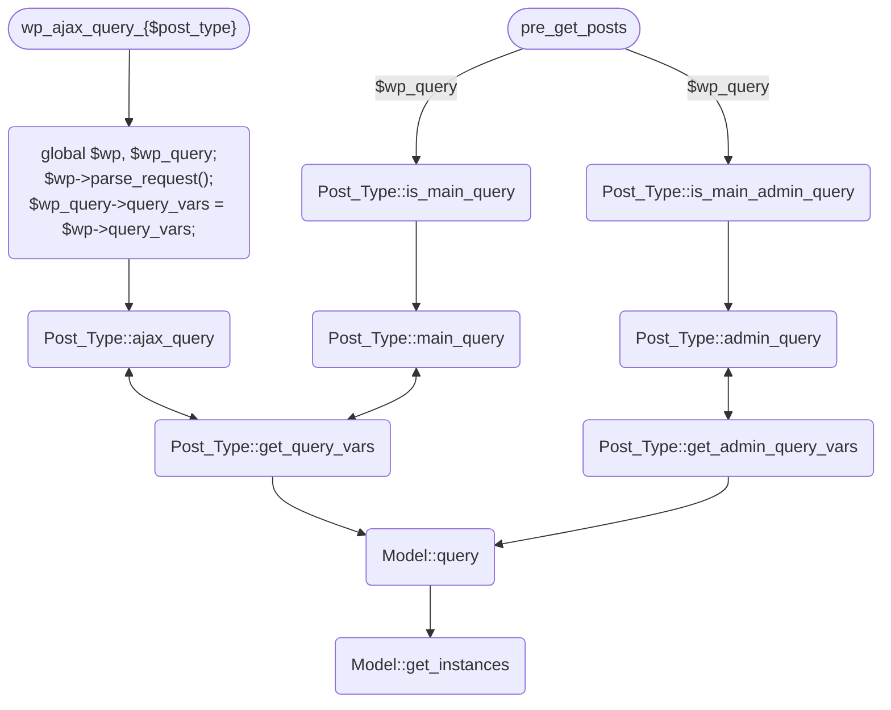

# digitalis-framework

some abstract objects.

## The WordPress Query Controller

## The Digitalis Query Controller

Digitalis Framework extends the functionality of WordPress queries rather than overwriting them.

